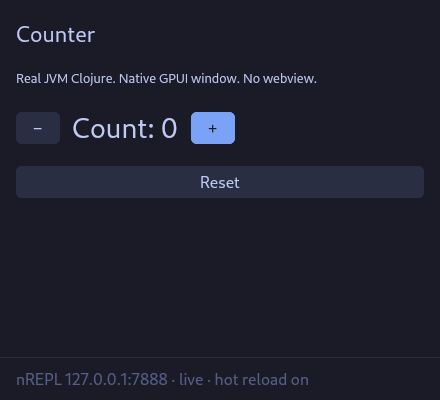

# clj-gpui

[](https://github.com/gitwyrm/clj-gpui/actions/workflows/ci.yml)

A library for writing **native GPUI applications in real Clojure**.

This is not a Clojure-like language, a Lisp-inspired DSL, or a toy interpreter. Application code is ordinary JVM Clojure: `def`, `defn`, `defonce`, atoms, `#()`, `map`, macros, namespaces. Rust owns the GPUI window and translates Clojure data into native [gpui-component](https://crates.io/crates/gpui-component) widgets.

There is no Clojars release yet. Depend on this repo with `:local/root` or a git SHA. GitHub Actions runs `./scripts/ci.sh` on Ubuntu and macOS (host tests, Clojure tests, cljfmt, windowless protocol-test).

## Quick start

Requirements:

* A recent stable Rust toolchain (`cargo` on `PATH`)
* Java 21+ and the [Clojure CLI](https://clojure.org/guides/install_clojure)
* Linux or macOS (GPUI's current platforms)
* A working display. On Linux, GPUI needs Vulkan. Software rendering via Mesa lavapipe is enough for a first window.
* Linux host builds also need `libdbus-1-dev` (window capture for `gpui.runtime/preview-png`).
* If `cc` is clang, install `libstdc++-N-dev` for the GCC install clang selects (`cc -v` prints it; Ubuntu 24.04 clang 18 often wants 14). Otherwise rust-lld fails with `unable to find library -lstdc++`.

From a checkout of this repository:

```bash
# Clojure unit tests
clojure -M:test

# Format check / apply (cljfmt, community indentation)
clojure -M:cljfmt check
clojure -M:cljfmt fix

# End-to-end bridge test without opening a window
clojure -M:protocol-test

# All of the above plus host `cargo test` (what GitHub Actions runs)
./scripts/ci.sh

# Example native window (plain counter)
cd examples/counter && clj -M:dev

# Widget gallery (switch, slider, select, tabs, …)
cd examples/widgets && clj -M:dev

# Classic TodoMVC (light card, Enter to add)
cd examples/todomvc && clj -M:dev

# Custom ThemeSet defined in Clojure (Catppuccin Violet)
cd examples/themes/catppuccin-violet && clj -M:dev
```

Or from the repo root:

```bash
./scripts/run.sh
```

On first run, `gpui.dev` builds `host/` with `cargo build --release` if the binary is missing. Later runs rebuild when a host source file (`host/src/**/*.rs`, `Cargo.toml`, `Cargo.lock`) is newer than the binary. GPUI and its GPU stack take a while to compile once. A custom Cargo `--target` (or `[build] target` in `.cargo/config.toml`) is fine: the launcher looks under `target/<triple>/release/` as well as `target/release/`. Set `CLJ_GPUI_BIN` to skip Cargo entirely.



The window footer shows the nREPL port (7888 by default). Connect with CIDER, Calva, or:

```bash
clojure -M:connect
```

Then, while the native window is running:

```clojure
(in-ns 'counter.app)
(swap! !state assoc :count 100)
(defn app [] (gpui.ui/label "Redefined from nREPL"))
(gpui.ui/request-render!)
;; Snapshot the native window (Evalight Preview uses this)
(gpui.runtime/preview-png) ; nil, or a base64 PNG string
```

Atom watches already request a rerender. Redefining `app` without changing an atom needs `(gpui.ui/request-render!)`.

### Hot reload

Edit `examples/counter/src/counter/widgets.clj` or `app.clj` and save. The watcher reloads the changed namespaces (helpers first), then the root app, and asks GPUI to paint again. `defonce` / `r/atom` state survives because namespaces are not unloaded. A compile error is shown in the window until the file is fixed.

## Use it in your project

Until this is published, add a git or local dependency:

```clojure
;; next to a checkout
{:deps {clj-gpui/clj-gpui {:local/root "../clj-gpui"}}
 :aliases {:dev {:main-opts ["-m" "gpui.dev" "my.app/app"]}}}

;; git SHA (no Clojars yet)
{:deps {clj-gpui/clj-gpui {:git/url "https://github.com/YOUR/clj-gpui.git"
                           :git/sha "REPLACE_WITH_SHA"}}}
```

Copy `template/` as a starting app. Then:

```bash
clj -M:dev
```

`gpui.dev` binds a local TCP port, starts nREPL, watches `src/`, and spawns the native host. The host **connects** to Clojure; it does not launch the JVM.

If Cargo is not on `PATH`, build `host/` yourself and set `CLJ_GPUI_BIN` to that executable. `CLJ_GPUI_ROOT` points at a library checkout that contains `host/`.

## Application code

Prefer `[gpui.ui :as ui]` and `[gpui.ratom :as r]`. `gpui.core` re-exports `gpui.ui` for older snippets.

```clojure
(ns my.app
  (:require [gpui.ratom :as r]
            [gpui.ui :as ui]))

(defonce !state (r/atom {:count 0 :draft ""}))

(defn app []
  (let [{:keys [count draft]} @!state]
    (ui/window
     {:title "clj-gpui" :chrome :dev :theme "Tokyo Night"}
     (ui/vstack
      {:gap 12 :padding 8}
      (ui/label "clj-gpui" {:font-size 22 :font-weight :bold})
      (ui/label (str "Count: " count))
      (ui/hstack
       {:gap 8}
       (ui/button "−" #(swap! !state update :count dec))
       (ui/button "+" #(swap! !state update :count inc) {:primary true}))
      (ui/text-field
       draft
       {:id "note"
        :placeholder "A native text field"
        :on-change #(swap! !state assoc :draft %)})))))
```

That data is rendered as a native GPUI window: no browser, no webview, no Electron, no HTML, no CSS, no React. Buttons and checkboxes use 0-argument handlers. Switches and toggles pass a boolean. Sliders and number-inputs pass a number. Select, radio-group, tabs, breadcrumb, accordion, list, table, tree, virtual-list, sidebar, and menus pass the **original Clojure option id** (keywords stay keywords; strings stay strings). Text fields and the highlighter editor pass the current string to `:on-change` / `:on-submit`. OTP `:on-change` fires only when every cell is filled. Color-picker passes a hex string. Date-picker passes an ISO date or `[start end]`. Settings pass `{:id … :value …}`. `:on-double-click` is 0-arg. `:on-blur` gets the field string; `:on-escape` is 0-arg. `:on-close` on alerts, dialogs, sheets, and notifications is 0-arg. Popover / dialog / sheet `:on-open-change` receives a boolean.

## Architecture

```text
┌──────────────────────────────────────────────┐
│              Clojure process                 │
│  gpui.dev listens on 127.0.0.1:<ephemeral>   │
│  gpui.ui / gpui.ratom / your app             │
│  nREPL · file watcher                        │
└──────────────────────▲───────────────────────┘
                       │ newline-delimited JSON
                       │ host connects as client
┌──────────────────────┴───────────────────────┐
│              Rust process                    │
│  GPUI window / gpui-component widgets        │
│  renderer.rs  ← UI tree as JSON maps         │
│  bridge.rs    ← TCP client + RPC             │
└──────────────────────────────────────────────┘
```

The UI boundary is ordinary persistent Clojure maps. Functions cannot go on the wire; they become callback ids (`"cb-2"`). See [docs/protocol.md](docs/protocol.md).

### Why this architecture

| Approach | Verdict |
|---|---|
| **JVM Clojure + local IPC** (this library) | Real Clojure, real nREPL, UI-as-data, GPUI keeps the OS event loop. |
| JNI embedding of the JVM in the GPUI process | Attractive later for a single process. The logical protocol would look the same. |
| GraalVM Native Image | Useful for distribution later. Fights REPL / hot reload. |
| jank | Real Clojure dialect, but not a GPUI host today. |
| Clojure-to-Rust compiler | Long-term inspiration (ClojureDart analogue). Not this repository. |
| A Lisp interpreter in Rust | Rejected. That would not be Clojure. |

### Rerendering

`(r/atom ...)` returns a real `clojure.core/Atom`. The only extra behavior is an `add-watch` (`:gpui.ratom/watch`) that sends `request-render`. The host fetches a fresh tree and paints the whole window.

The host also fetches a tree after every callback (text-field submit sequencing, and handlers that do not touch an atom). During that callback Clojure does not send a second `request-render` from the watch, so a typical `swap!` click is one paint.

`ui/watch!` attaches the same watch to an existing atom.

### Hot reload

Edit any application `src/**/*.clj` and save. The watcher reloads the namespaces for those files (so a helper like `my.widgets` is picked up), then the root app namespace, with `(require ns :reload)`. `(require root :reload)` alone does **not** reload already-loaded dependencies. `clojure.tools.namespace` `refresh` is not used, because unloading namespaces would reset `defonce`.

If `app` throws, or if reload itself fails (syntax error, unmatched delimiter, unresolved symbol), Clojure returns an error UI tree (`ok: true`) so the native window still paints. Fix the file and save again; the app returns and `defonce` / `r/atom` state is kept.

## Formatting

Clojure is formatted with [cljfmt](https://github.com/weavejester/cljfmt) using [community indentation](https://guide.clojure.style/#one-space-indent) (one space when arguments start on the next line). Config is `.cljfmt.edn`. It covers `src/`, `test/`, `examples/`, and `template/`.

```bash
clojure -M:cljfmt check
clojure -M:cljfmt fix
```

The native host is ordinary Rust: `cargo fmt` in `host/` if you touch it.

## Repository layout

```text
deps.edn                      ; git-dep library entry
.cljfmt.edn                   ; cljfmt paths and community indentation
src/gpui/ui.clj               ; public widgets
src/gpui/theme.clj            ; register custom gpui-component ThemeSets
src/gpui/ratom.clj            ; (r/atom ...)
src/gpui/core.clj             ; compatibility re-export of gpui.ui
src/gpui/runtime.clj          ; protocol, callbacks, nREPL, watcher
src/gpui/host.clj             ; locate/build/spawn the native host
src/gpui/dev.clj              ; development launcher (nREPL, watcher, Cargo)
src/gpui/prod.clj             ; production launcher (no nREPL/watcher/Cargo)
src/gpui/platform.clj         ; folder picker, reveal/open path
src/gpui/package.clj          ; `clj -X:build package`
host/                         ; native GPUI + gpui-component host
host/themes/                  ; bundled gpui-component palettes (Tokyo Night, Ayu, …)
examples/counter/             ; plain counter
examples/widgets/             ; gallery of newly supported widgets
examples/todomvc/             ; classic TodoMVC layout
examples/themes/              ; custom ThemeSet (Catppuccin Violet)
template/                     ; copyable app skeleton
test/                         ; unit tests + gpui.test-app
docs/protocol.md
docs/gpui-component.md        ; coverage inventory vs gpui-component 0.5.1
```

## Clojure UI API

```clojure
(ui/label "Hello" {:font-size 20 :font-weight :bold :color "#c0caf5"})
(ui/button "+" on-click)
(ui/button "Save" save! {:primary true})
(ui/window {:title "Todos" :chrome :app :width 640 :height 820 :theme "Tokyo Night"} ...)
(ui/vstack {:theme :light :gap 8 :padding 16} ...)
(ui/hstack ...)
(ui/spacer)
(ui/checkbox checked on-click "Label")
(ui/checkbox done toggle {:shape :circle})
(ui/label title {:on-double-click start-edit})
(ui/scroll {:flex 1} ...)          ; leftover height in a column
(ui/scroll {:height 220} ...)      ; fixed viewport
(ui/scroll {:width 300} ...)       ; constrain viewport width
(ui/text-field value {:placeholder "…" :on-change f :on-submit g :on-blur save :on-escape cancel :focus true})
(ui/switch on? {:on-change #(swap! !state assoc :on %)})
(ui/toggle bold? {:on-change set-bold! :text "Bold"})
(ui/radio-group selected {:options [{:id :light :label "Light"} :dark]
                          :on-change set-mode! :orientation :horizontal})
(ui/slider volume {:min 0 :max 100 :on-change set-volume!})
(ui/progress 45)
(ui/select selected {:options [{:id :clj :label "Clojure"} "Rust"]
                     :placeholder "Language"
                     :searchable true
                     :on-change set-lang!})
(ui/tabs tab {:items [{:id :general :label "General"}]
              :variant :underline
              :on-change set-tab!})
(ui/divider)
(ui/divider "or")
(ui/tag "Beta" {:variant :info})
(ui/alert "Saved" {:variant :success :title "Done" :on-close hide!})
(ui/spinner {:size :small})
(ui/skeleton {:width 200 :height 12})
(ui/kbd "ctrl-s")
(ui/link "https://clojure.org" "Clojure")
(ui/icon :check)
(ui/badge 3 (ui/icon :bell))
(ui/clipboard "copy me")
(ui/avatar "Ada Lovelace")
(ui/breadcrumb [{:id :home :label "Home"} "Project"])
(ui/group-box {:title "Audio" :variant :outline} …)
(ui/accordion open-id {:items [{:id :a :title "One" :content (ui/label "…")}]
                       :on-change set-open!})
(ui/description-list [{:label "Host" :value "GPUI"}])
(ui/description-list items {:orientation :horizontal :columns 2})
(ui/dialog open? {:title "Delete?" :variant :confirm :on-ok delete! :on-close hide!}
  (ui/label "This cannot be undone."))
(ui/popover open? {:trigger (ui/button "More") :on-open-change set-open!}
  (ui/label "Hint"))
(ui/dropdown-menu [{:id :copy :label "Copy"} :- {:id :paste :label "Paste"}]
                  {:on-change handle!}
                  (ui/button "Edit"))
(ui/context-menu items {:on-change handle!} (ui/table {:columns cols :rows rows :flex 1}))
(ui/list items {:selected sel :on-change set-sel! :searchable true :height 200})
(ui/table {:columns [{:id :name :label "Name"} {:id :lang :label "Lang"}]
           :rows [{:id :ada :cells ["Ada" "Clojure"]}]
           :selected :ada
           :on-change set-row!})
(ui/tree [{:id :src :label "src" :expanded true
           :items [{:id :lib :label "lib.rs"}]}]
         {:on-change set-node!})
(ui/sheet open? {:title "Inspect" :placement :right :on-close hide!}
  (ui/label "Details"))
(ui/notification {:variant :success :title "Saved" :message "ok"})
(ui/number-input 42 {:min 0 :max 100 :step 1 :on-change set!})
(ui/otp-input code {:count 6 :on-change set!})
(ui/color-picker "#3366ff" {:on-change set!})
(ui/date-picker "2026-09-02" {:on-change set!})
(ui/editor src {:language "rust" :height 200 :on-change set!})
(ui/virtual-list items {:selected id :on-change set! :height 200})
(ui/chart :line [{:id :a :label "A" :value 10}] {:height 180})
(ui/markdown "# Hello")
(ui/sidebar items {:selected id :side :left :on-change set!})
(ui/settings pages {:on-change (fn [{:keys [id value]}])})
(ui/dock {:items [{:id :files :side :left :label "Files"
                   :content (ui/markdown "…")}]})
(ui/resizable {:orientation :horizontal} pane-a pane-b)
(ui/button "Save" save! {:tooltip "Write the file"})
```

`:size :small` on controls becomes wire `:control-size` so numeric `:size` stays pixel layout. Option ids are strings on the wire; `:on-change` restores the original Clojure id (`:light` not `"light"`). Two options that share a wire id (`:dark` and `"dark"`) keep the first. `nil` on `ui/select` clears the selection. `:searchable true` filters select options by label.

gpui-component 0.5.1 coverage (what is wrapped, deferred, or intentionally not exposed) lives in [docs/gpui-component.md](docs/gpui-component.md).

Return `ui/window` from `app`. `:title`, `:chrome`, and `:width` / `:height` only make sense there. `:chrome :dev` (default) shows the nREPL footer; `:chrome :app` hides it.

Native platform actions (folder picker, reveal in Finder / the file manager) live in `[gpui.platform :as platform]`:

```clojure
(platform/pick-directory
 {:title "Choose a folder"}
 (fn [{:keys [path cancelled error]}]
   (when path (swap! !state assoc :root path))))

(platform/reveal-path! "/tmp")
(platform/open-path! "/tmp")
```

`pick-directory` is asynchronous: it returns immediately and later calls `on-result`. On Linux the host uses the desktop portal, then `zenity` if the portal is unavailable. The zenity wait runs off the GPUI foreground executor.

Labels, `vstack`, and `hstack` accept `:on-click` (0-arg), so a list row can be a clickable stack.

`:theme` is a style on any node. Three kinds of value:

* **Appearance** — `:system` (follow the OS, the default), `:light`, or `:dark`. Those pin gpui-component's Default Light / Default Dark.
* **Named palettes** — a gpui-component theme the host ships: `"Tokyo Night"`, `:ayu-light`, `"Catppuccin Mocha"`. Names match case-insensitively; `-` and `_` are spaces. `ui/themes` is that shipped list plus appearance keywords. It does not include custom themes.
* **Custom ThemeSets** — ordinary Clojure maps registered with `gpui.theme/register!`, then referenced by name. A **family** name (`"Catppuccin Violet"`) picks the light or dark member from OS appearance. A **variant** name (`"Catppuccin Violet Dark"`) pins that config.

```clojure
(ui/window
 {:title "Counter" :theme "Tokyo Night" :width 440 :height 400}
 (ui/vstack {:gap 16 :padding 16}
   (ui/label "Counter")
   (ui/button "+" inc! {:primary true})))

(ui/window
 {:title "Studio" :width 960 :height 640}
 (ui/hstack
  {:flex 1}
  (ui/vstack {:theme :dark :width 220 :padding 12} (ui/label "Nav"))
  (ui/vstack {:theme "Ayu Light" :flex 1 :padding 16} (ui/label "Canvas"))))
```

Define a custom palette as JVM Clojure data (gpui-component color tokens such as `:primary.background`). `theme-set` validates `:name`, `:mode`, and hex `:colors`; other ThemeConfig keys (`:highlight`, `:font.family`, `:radius`, `:shadow`) are kept and sent with gpui-component's JSON names. Register once from a theme namespace (not from `app` on every render). Names match the host: `"My Theme"`, `"my-theme"`, and `:my_theme` are the same set.

```clojure
(ns my.themes
  (:require [gpui.theme :as theme]))

(def mine
  (theme/theme-set
   {:name "Mine"
    :themes [{:name "Mine Light" :mode :light :colors {:background "#eff1f5"
                                                       :primary.background "#7c3aed"}}
             {:name "Mine Dark" :mode :dark :colors {:background "#1e1e2e"
                                                     :primary.background "#cba6f7"}}]}))

(theme/register! mine)

;; in app:
(ui/window {:theme "Mine Dark"} ...)
;; or {:theme "Mine"} to follow OS light/dark within this pair
```

See `examples/themes/catppuccin-violet` for a full pair ported from [utility_belt_gpui](https://github.com/gitwyrm/utility_belt_gpui) `src/theme.rs` (MIT OR Apache-2.0). That crate is not a runtime dependency.

JSON still works: put extra theme-set files (same schema as [gpui-component themes](https://longbridge.github.io/gpui-component/docs/theme)) in `./themes` or `$CLJ_GPUI_THEMES`. Those override bundled names. Clojure-registered sets override JSON. Hex `:bg` / `:color` still win on that node when you set them.

`when` returning `nil`, `map`, and nested vectors are flattened by `ui/flatten-children`.

## Environment

| Variable | Meaning |
|---|---|
| `CLJ_GPUI_BIN` | Path to a `clj-gpui` executable, skipping Cargo |
| `CLJ_GPUI_ROOT` | Library checkout containing `host/` |
| `CLJ_GPUI_APP_HOME` | Directory of the bundled host (set by packaged launchers) |
| `CLJ_GPUI_PORT` | Set by `gpui.dev` / `gpui.prod` for the host (do not set yourself) |
| `CLJ_GPUI_HOST` | TCP host for the host process, default `127.0.0.1` |
| `CLJ_GPUI_APP` | Root var if not passed to `gpui.dev` |
| `CLJ_GPUI_SRC` | Directory the watcher scans, default `src` |
| `CLJ_GPUI_NREPL_PORT` | Preferred nREPL port, default `7888` |
| `CLJ_GPUI_THEMES` | Extra gpui-component theme-set JSON directory (overrides bundled names) |
| `VK_ICD_FILENAMES` | Linux software Vulkan ICD (lavapipe) |

## Known limitations

* **Two processes, JSON copies.** Fine for this slice. A future JNI path can keep the same Clojure API.
* **Whole-window rerender.** No incremental DOM-style diffing.
* **gpui-component Theme is process-global.** Nested `:theme` restores the previous palette before a sibling paints. That is safe for one window; a second window would share the global. Headless GPUI cannot paint two themed buttons here without a real window.
* **Callback ids are per-tree.** In-flight clicks after a reload can miss if the id was rebuilt.
* **Linux Vulkan.** Headless checks should use `clojure -M:protocol-test`. For a window without a discrete GPU, Mesa lavapipe works (`VK_ICD_FILENAMES=/usr/share/vulkan/icd.d/lvp_icd.json`).
* **`preview-png` is an OS window shot**, not GPU readback. Linux/Windows spawn `clj-gpui --capture-preview --pid <host-pid>` and [xcap](https://crates.io/crates/xcap) 0.4.1. That Linux path is X11/XCB: X11 and XWayland windows capture; native Wayland windows are not reliably enumerated and may return `nil`. macOS captures in-process with ScreenCaptureKit, and only then disables GPUI's occluded display-link pause ([zed#63217](https://github.com/zed-industries/zed/issues/63217)). Missing macOS Screen Recording permission returns `nil`. Xvfb/X11 is the deterministic Linux CI path.
* **Packaging** is native-only (macOS `.app` on macOS, AppImage/deb on Linux). See [Packaging](#packaging).

## Packaging

A packaged app is still two processes: a bundled JRE running `gpui.prod`, plus the bundled GPUI host. `gpui.prod` does **not** start nREPL, watch source, or invoke Cargo.

In the application repo, add `gpui.edn`:

```clojure
{:name "my-app"
 :version "0.1.0"
 :main my.app/app
 :id "com.example.my-app"
 :icon "resources/icon.png"
 :title "My App"
 :description "A native GPUI application"}
```

and a `:build` alias that puts tools.build on the classpath **without** replacing project deps (`:extra-deps`, used with `-X`):

```clojure
:aliases
{:dev {:main-opts ["-m" "gpui.dev" "my.app/app"]}
 :build {:extra-deps {io.github.clojure/tools.build {:mvn/version "0.10.10"}}
         :ns-default gpui.package
         :exec-fn gpui.package/package}}
```

Then, on the target OS:

```bash
clj -X:build package
```

Use `-X` (not `-T`): `gpui.package` lives in the clj-gpui library, so the project deps must stay on the classpath. `-T` would replace them. `clj -X:build` with `:exec-fn gpui.package/package` is the same default.

| Host OS | Output under `target/package/` |
|---|---|
| macOS | `Name.app` |
| Linux | `name-version-<arch>.AppImage` and `name_version_<arch>.deb` |

The `.app` / AppImage / `.deb` include a jlink JRE (invoked via the JDK's absolute `jlink`, not PATH), the application uberjar, and the GPUI host. End users do not need Rust, Cargo, the Clojure CLI, or a system JDK.

If the application repo has `LICENSE` and/or `NOTICE` at the root, those files are copied into the package:

| Package | Destination |
|---|---|
| macOS `.app` | `Contents/Resources/licenses/` |
| Linux AppImage | `usr/share/doc/<name>/` |
| Linux `.deb` | `/usr/share/doc/<name>/` |

Additional files can be listed in `gpui.edn` as `:license-files` (paths relative to the project root). This is not a third-party license scanner.

Linux AppImage packaging uses a system `appimagetool` when that command is on `PATH`. Otherwise it downloads the pinned [appimagetool 1.9.1](https://github.com/AppImage/appimagetool/releases/tag/1.9.1) release (not the mutable `continuous` tag) and checks a SHA-256.

Other tasks: `clj -X:build uberjar`, `clj -X:build host`, `clj -X:build jre`.

macOS codesigning / notarization is not done by `package`. After a local `.app` exists:

```bash
codesign --deep --force --sign - MyApp.app          # ad-hoc, local
# later, with a Developer ID:
codesign --deep --force --options runtime --sign "Developer ID Application: …" MyApp.app
xcrun notarytool submit MyApp.app --wait --keychain-profile "notary"
xcrun stapler staple MyApp.app
```

## License

MIT, unless a later commit says otherwise. GPUI is Apache-2.0. Bundled palettes under `host/themes/` come from gpui-component (Apache-2.0). The Catppuccin Violet example is adapted from utility_belt_gpui (MIT OR Apache-2.0).
